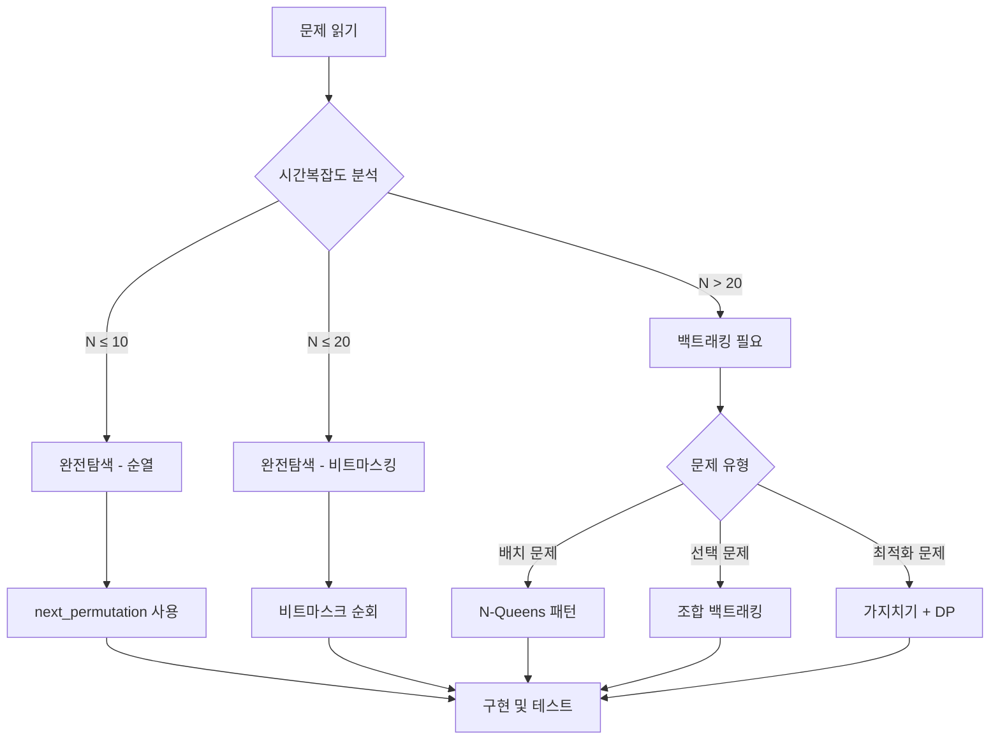

# ch4 완전탐색 & 백트래킹 실전 스킬 요약

## 🔥 핵심 스킬 암기용

### 완전탐색 vs 백트래킹 선택 기준
```
완전탐색 (Brute Force): 모든 경우의 수 체크, 답이 보장됨
백트래킹 (Backtracking): 조건 위반시 즉시 중단, 효율적 탐색

시간복잡도 기준:
- N ≤ 10: 팩토리얼 가능 (N! ≈ 3,628,800)
- N ≤ 20: 2^N 가능 (2^20 ≈ 1,000,000)
- N ≤ 1,000: O(N²) 가능
- N ≤ 100,000: O(N log N) 가능
```

### 스킬 1: 완전탐색 기본 패턴
```cpp
// 1. 이중 for문 - 모든 쌍 체크
for (int i = 0; i < n; i++) {
    for (int j = i + 1; j < n; j++) {
        // (i, j) 조합 처리
        if (조건만족) answer++;
    }
}

// 2. 순열 생성 - next_permutation
sort(arr, arr + n);
do {
    // 현재 순열 처리
    if (조건만족) answer++;
} while (next_permutation(arr, arr + n));

// 3. 부분집합 - 비트마스킹
for (int mask = 0; mask < (1 << n); mask++) {
    for (int i = 0; i < n; i++) {
        if (mask & (1 << i)) {
            // i번째 원소 선택됨
        }
    }
}
```

### 스킬 2: 백트래킹 기본 템플릿
```cpp
void backtrack(int depth, vector<int>& path) {
    // 1. 종료 조건
    if (depth == target_depth) {
        // 답 처리
        answer++;
        return;
    }
    
    // 2. 가지치기 (중요!)
    if (현재상태가_불가능) return;
    
    // 3. 다음 선택지 탐색
    for (int next = 시작; next <= 끝; next++) {
        if (선택가능(next)) {
            path.push_back(next);  // 선택
            backtrack(depth + 1, path);
            path.pop_back();       // 선택 취소
        }
    }
}
```

### 스킬 3: N-Queens 패턴
```cpp
// 체스판 공격 체크 최적화
bool canPlace(int row, int col) {
    for (int i = 0; i < row; i++) {
        // 같은 열, 대각선 체크
        if (queens[i] == col || 
            abs(queens[i] - col) == abs(i - row)) {
            return false;
        }
    }
    return true;
}

void nQueens(int row) {
    if (row == n) { answer++; return; }
    
    for (int col = 0; col < n; col++) {
        if (canPlace(row, col)) {
            queens[row] = col;
            nQueens(row + 1);
        }
    }
}
```

## 📋 문제 유형별 솔루션 템플릿

### Type A: 순열/조합 생성 문제
```
문제 키워드: "순서", "배치", "선택", "조합"
```

**순열 vs 조합 구분:**
```
순열: 순서 중요 (1,2,3 ≠ 3,2,1) → next_permutation
조합: 순서 무관 (1,2,3 = 3,2,1) → 백트래킹으로 선택
```

**템플릿 1: STL 순열**
```cpp
// 10974: 모든 순열
vector<int> v(n);
iota(v.begin(), v.end(), 1);  // 1,2,3...n
do {
    for (int x : v) cout << x << " ";
    cout << '\n';
} while (next_permutation(v.begin(), v.end()));
```

**템플릿 2: 백트래킹 조합**
```cpp
// 15649: N과 M (1) - 순열
void solve(int depth) {
    if (depth == m) {
        for (int i = 0; i < m; i++) cout << path[i] << " ";
        cout << '\n';
        return;
    }
    
    for (int i = 1; i <= n; i++) {
        if (!visited[i]) {
            visited[i] = true;
            path[depth] = i;
            solve(depth + 1);
            visited[i] = false;
        }
    }
}
```

### Type B: 부분집합 문제 (비트마스킹)
```
문제 키워드: "부분집합", "선택", "포함/미포함"
```

**비트마스킹 시각화:**
```
n=3일 때 모든 부분집합:
mask=0 (000): {} 
mask=1 (001): {0}
mask=2 (010): {1}
mask=3 (011): {0,1}
mask=4 (100): {2}
mask=5 (101): {0,2}
mask=6 (110): {1,2}
mask=7 (111): {0,1,2}
```

**템플릿:**
```cpp
// 1182: 부분수열의 합
int count = 0;
for (int mask = 1; mask < (1 << n); mask++) {  // 공집합 제외
    int sum = 0;
    for (int i = 0; i < n; i++) {
        if (mask & (1 << i)) {
            sum += arr[i];
        }
    }
    if (sum == S) count++;
}
```

### Type C: 보드게임/퍼즐 문제
```
문제 키워드: "체스", "스도쿠", "퍼즐", "배치"
```

**스도쿠 백트래킹 시각화:**
```
단계별 해결:
1. 빈 칸 찾기
2. 1~9 숫자 시도
3. 유효성 검사 (행/열/3×3 박스)
4. 재귀 호출
5. 실패시 되돌리기

유효성 검사 최적화:
- 행/열/박스별 사용된 숫자 비트마스크로 관리
- O(1) 시간에 체크 가능
```

**템플릿:**
```cpp
// 2580: 스도쿠
bool isValid(int row, int col, int num) {
    // 행 체크
    for (int i = 0; i < 9; i++) {
        if (board[row][i] == num) return false;
    }
    // 열 체크  
    for (int i = 0; i < 9; i++) {
        if (board[i][col] == num) return false;
    }
    // 3×3 박스 체크
    int boxRow = (row / 3) * 3;
    int boxCol = (col / 3) * 3;
    for (int i = boxRow; i < boxRow + 3; i++) {
        for (int j = boxCol; j < boxCol + 3; j++) {
            if (board[i][j] == num) return false;
        }
    }
    return true;
}

bool solveSudoku() {
    for (int i = 0; i < 9; i++) {
        for (int j = 0; j < 9; j++) {
            if (board[i][j] == 0) {
                for (int num = 1; num <= 9; num++) {
                    if (isValid(i, j, num)) {
                        board[i][j] = num;
                        if (solveSudoku()) return true;
                        board[i][j] = 0;  // 백트래킹
                    }
                }
                return false;
            }
        }
    }
    return true;
}
```

### Type D: 최적화 문제 (가지치기)
```
문제 키워드: "최대/최소", "최적해", "효율적"
```

**가지치기 전략:**
```cpp
// 1. 현재 최선해보다 나쁘면 중단
if (current_cost >= best_answer) return;

// 2. 남은 최선 경우로도 불가능하면 중단  
if (current_cost + optimistic_remaining > best_answer) return;

// 3. 조건 위반시 즉시 중단
if (constraint_violated) return;
```

**템플릿: TSP (외판원 문제)**
```cpp
// 2098: 외판원 순회
int tsp(int current, int visited) {
    if (visited == (1 << n) - 1) {
        return graph[current][0] == 0 ? INF : graph[current][0];
    }
    
    if (dp[current][visited] != -1) return dp[current][visited];
    
    int result = INF;
    for (int next = 0; next < n; next++) {
        if (visited & (1 << next)) continue;
        if (graph[current][next] == 0) continue;
        
        result = min(result, 
            graph[current][next] + tsp(next, visited | (1 << next)));
    }
    
    return dp[current][visited] = result;
}
```

### Type E: 문자열 생성 문제
```
문제 키워드: "문자열 만들기", "패스워드", "조건 만족"
```

**템플릿:**
```cpp
// 1759: 암호 만들기
void makePassword(int pos, int selected, string& password) {
    if (selected == L) {
        int vowels = 0, consonants = 0;
        for (char c : password) {
            if (c == 'a' || c == 'e' || c == 'i' || c == 'o' || c == 'u') {
                vowels++;
            } else {
                consonants++;
            }
        }
        if (vowels >= 1 && consonants >= 2) {
            cout << password << '\n';
        }
        return;
    }
    
    if (pos == C) return;
    
    // 현재 문자 선택
    password += letters[pos];
    makePassword(pos + 1, selected + 1, password);
    password.pop_back();
    
    // 현재 문자 미선택
    makePassword(pos + 1, selected, password);
}
```

## 🎯 암기용 치트시트

### 완전탐색 시간복잡도 체크
```cpp
// N의 범위별 적용 가능한 알고리즘
N ≤ 10:     O(N!) ≈ 3,628,800
N ≤ 15:     O(2^N) ≈ 32,768  
N ≤ 20:     O(2^N) ≈ 1,048,576
N ≤ 100:    O(N³) ≈ 1,000,000
N ≤ 1,000:  O(N²) ≈ 1,000,000
N ≤ 100,000: O(N log N) ≈ 1,664,386
```

### 백트래킹 가지치기 패턴
```cpp
// 1. Bound 체크 (한계값)
if (current + remaining_min > target) return;

// 2. Constraint 체크 (제약조건)  
if (violates_rule) return;

// 3. 최적해 갱신
if (is_complete && is_better) {
    best_answer = current_answer;
    return;
}

// 4. 중복 제거
if (i > 0 && arr[i] == arr[i-1] && !used[i-1]) continue;
```

### 순열/조합 구분법
```cpp
// 순열: 순서 O, 중복 X
void permutation(int depth) {
    if (depth == r) { /* 처리 */ return; }
    for (int i = 0; i < n; i++) {
        if (!visited[i]) {
            visited[i] = true;
            path[depth] = arr[i];
            permutation(depth + 1);
            visited[i] = false;
        }
    }
}

// 조합: 순서 X, 중복 X  
void combination(int start, int depth) {
    if (depth == r) { /* 처리 */ return; }
    for (int i = start; i < n; i++) {
        path[depth] = arr[i];
        combination(i + 1, depth + 1);
    }
}

// 중복조합: 순서 X, 중복 O
void combination_with_repetition(int start, int depth) {
    if (depth == r) { /* 처리 */ return; }
    for (int i = start; i < n; i++) {
        path[depth] = arr[i];
        combination_with_repetition(i, depth + 1);  // i+1이 아닌 i
    }
}
```

## 💡 실수 방지 체크리스트

### 🚫 자주 하는 실수들

1. **백트래킹에서 상태 복원 까먹기**
   ```cpp
   path.push_back(x);
   backtrack(depth + 1);
   path.pop_back();  // 필수!
   ```

2. **순열에서 중복 체크 실수**
   ```cpp
   if (!visited[i]) {  // 이미 사용된 원소 체크
       visited[i] = true;
       // ... 처리
       visited[i] = false;  // 복원
   }
   ```

3. **비트마스킹에서 인덱스 실수**
   ```cpp
   if (mask & (1 << i)) {  // i번째 비트 체크
       // i번째 원소가 선택됨
   }
   ```

4. **조합에서 시작점 실수**
   ```cpp
   void combination(int start, int depth) {
       for (int i = start; i < n; i++) {  // start부터 시작!
           combination(i + 1, depth + 1);
       }
   }
   ```

### ✅ 디버깅 팁
```cpp
// 경로 출력으로 탐색 과정 확인
void debug_path(vector<int>& path) {
    cout << "현재 경로: ";
    for (int x : path) cout << x << " ";
    cout << '\n';
}

// 가지치기 로그
if (pruning_condition) {
    cout << "가지치기 발생: " << 이유 << '\n';
    return;
}
```

## 🔍 문제 해결 플로우차트



## 📊 문제별 해결 전략

| 문제번호 | 유형 | 핵심스킬 | 한줄요약 |
|---------|------|----------|----------|
| 15649 | 순열백트래킹 | visited배열 | N개 중 M개 순열 |
| 15650 | 조합백트래킹 | start인덱스 | N개 중 M개 조합 |
| 1182 | 부분집합 | 비트마스킹 | 부분수열 합 개수 |
| 1759 | 문자열백트래킹 | 조건체크 | 암호 만들기 |
| 2580 | 보드백트래킹 | 제약조건체크 | 스도쿠 해결 |
| 9663 | N-Queens | 대각선체크 | 체스 퀸 배치 |
| 1987 | DFS백트래킹 | 문자방문체크 | 알파벳 최대경로 |
| 2098 | 최적화백트래킹 | DP+비트마스크 | TSP 외판원 |

---

**기억할 것:** 
- 시간복잡도 먼저 계산하기
- 백트래킹에서 상태 복원 필수
- 가지치기로 효율성 높이기
- 중복 제거 조건 정확히 구현하기