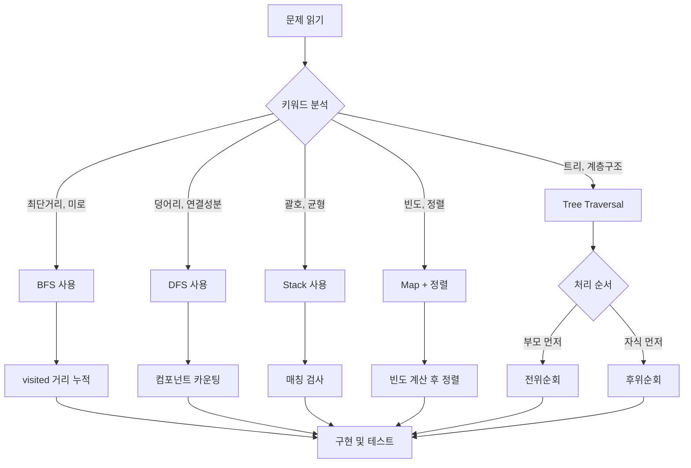

# ch3 알고리즘 실전 스킬 요약

## 🔥 핵심 스킬 암기용

### 4방향 탐색 시각화
```
    (-1,0)
      ↑
(0,-1)← * →(0,1)  
      ↓
    (1,0)

dy[4] = {-1, 0, 1, 0};  // 상우하좌
dx[4] = {0, 1, 0, -1};
```

### 스킬 1: 그래프 탐색 기본 세팅
```cpp
// 무조건 외우기
const int MAX = 104;
int grid[MAX][MAX], visited[MAX][MAX];
int dy[4] = {-1, 0, 1, 0};  // 상우하좌
int dx[4] = {0, 1, 0, -1};
```

### 스킬 2: DFS 연결된 컴포넌트 개수 세기
```cpp
// 패턴: 이차원 배열에서 덩어리 개수
int count = 0;
for (int i = 0; i < n; i++) {
    for (int j = 0; j < m; j++) {
        if (grid[i][j] == 1 && !visited[i][j]) {
            dfs(i, j);
            count++;  // 새로운 덩어리 발견
        }
    }
}
```

### 스킬 3: BFS 최단거리
```cpp
// 패턴: 미로 최단경로, 레벨별 탐색
void bfs(int sy, int sx) {
    queue<pair<int, int>> q;
    visited[sy][sx] = 1;  // 거리는 1부터 시작
    q.push({sy, sx});
    
    while (!q.empty()) {
        auto [y, x] = q.front();
        q.pop();
        
        for (int i = 0; i < 4; i++) {
            int ny = y + dy[i];
            int nx = x + dx[i];
            
            if (ny < 0 || ny >= n || nx < 0 || nx >= m) continue;
            if (grid[ny][nx] == 0 || visited[ny][nx]) continue;
            
            visited[ny][nx] = visited[y][x] + 1;
            q.push({ny, nx});
        }
    }
}
```

### 스킬 4: 트리 순회 (Tree Traversal)
```cpp
// DFS 기반 트리 순회
void preOrder(int node) {
    cout << node << " ";        // 현재 노드 먼저 처리
    for (int child : children[node]) {
        if (!visited[child]) preOrder(child);
    }
}

void postOrder(int node) {
    for (int child : children[node]) {   // 자식들 먼저 처리
        if (!visited[child]) postOrder(child);
    }
    cout << node << " ";        // 현재 노드는 나중에 처리
}
```

## 📋 문제 유형별 솔루션 템플릿

### Type A: 미로 탈출 (BFS)
```
문제 키워드: "최단경로", "최소 이동", "미로"
```

**BFS 거리 전파 시각화:**
```
시작: S=1       1회차:        2회차:        3회차:
┌─┬─┬─┐      ┌─┬─┬─┐      ┌─┬─┬─┐      ┌─┬─┬─┐
│1│ │ │      │1│2│ │      │1│2│3│      │1│2│3│
├─┼─┼─┤  →   ├─┼─┼─┤  →   ├─┼─┼─┤  →   ├─┼─┼─┤
│ │ │ │      │2│ │ │      │2│3│ │      │2│3│4│
├─┼─┼─┤      ├─┼─┼─┤      ├─┼─┼─┤      ├─┼─┼─┤
│ │ │G│      │ │ │G│      │3│ │G│      │3│4│G│
└─┴─┴─┘      └─┴─┴─┘      └─┴─┴─┘      └─┴─┴─┘
```

**의사코드:**
```
1. 그리드와 visited 배열 초기화
2. 시작점에서 BFS 시작
3. 4방향으로 이동하며 visited에 거리 누적
4. 목적지의 visited 값이 답
```

**실전 코드:**
```cpp
// 2178: 미로 탈출
visited[0][0] = 1;
bfs(0, 0);
cout << visited[n-1][m-1] << '\n';
```

### Type B: 섬/덩어리 개수 (DFS)
```
문제 키워드: "연결된 구역", "몇 개의 섬", "컴포넌트"
```

**DFS 컴포넌트 탐색 시각화:**
```
초기상태:        1번 DFS:       2번 DFS:       결과:
┌─┬─┬─┬─┐     ┌─┬─┬─┬─┐     ┌─┬─┬─┬─┐     count = 2
│1│1│0│1│     │V│V│0│1│     │V│V│0│V│     
├─┼─┼─┼─┤     ├─┼─┼─┼─┤     ├─┼─┼─┼─┤     덩어리1: 좌상단
│1│0│0│1│  →  │V│0│0│1│  →  │V│0│0│V│     덩어리2: 우측
├─┼─┼─┼─┤     ├─┼─┼─┼─┤     ├─┼─┼─┼─┤     
│0│1│1│0│     │0│1│1│0│     │0│1│1│0│     
└─┴─┴─┴─┘     └─┴─┴─┴─┘     └─┴─┴─┴─┘     
```

**의사코드:**
```
1. 전체 그리드를 순회
2. 방문하지 않은 유효한 칸 발견 시
3. DFS로 연결된 모든 칸 방문 처리
4. count++ (새로운 덩어리 발견)
```

**실전 코드:**
```cpp
// 1012: 유기농 배추
int ret = 0;
for (int i = 0; i < n; i++) {
    for (int j = 0; j < m; j++) {
        if (grid[i][j] == 1 && !visited[i][j]) {
            dfs(i, j);
            ret++;
        }
    }
}
```

### Type C: 안전 영역 (시뮬레이션 + DFS)
```
문제 키워드: "높이별 안전구역", "물에 잠기지 않는"
```

**의사코드:**
```
1. 모든 가능한 높이에 대해 반복
2. 각 높이에서 visited 배열 초기화
3. 해당 높이보다 높은 칸들로만 DFS
4. 최대 안전구역 개수 갱신
```

**실전 코드:**
```cpp
// 2468: 안전 영역
for (int h = 0; h <= maxHeight; h++) {
    memset(visited, 0, sizeof(visited));
    int safeCount = 0;
    for (int i = 0; i < n; i++) {
        for (int j = 0; j < n; j++) {
            if (grid[i][j] > h && !visited[i][j]) {
                dfs(i, j, h);
                safeCount++;
            }
        }
    }
    maxSafe = max(maxSafe, safeCount);
}
```

### Type D: 괄호 매칭 (Stack)
```
문제 키워드: "괄호", "균형잡힌", "올바른 괄호열"
```

**Stack 동작 시각화:**
```
입력: "([)]"

'(': push    │(│     ✓
'[': push    │[│(│   ✓  
')': check   │[│(│   ✗ top='[' != '(' → 실패!

입력: "([])"

'(': push    │(│     ✓
'[': push    │[│(│   ✓
']': pop     │(│     ✓ '[' 매칭
')': pop     │ │     ✓ '(' 매칭 → 성공!
```

**Stack 활용 패턴:**
```
열린괄호 → push
닫힌괄호 → 
  - stack 비어있음 → 실패
  - top이 매칭 안됨 → 실패
  - 매칭됨 → pop
```

**실전 코드:**
```cpp
// 9012, 4949: 괄호 검사
stack<char> stk;
for (char c : str) {
    if (c == '(' || c == '[') stk.push(c);
    else if (c == ')') {
        if (stk.empty() || stk.top() != '(') return false;
        stk.pop();
    }
    // 같은 방식으로 ']' 처리
}
return stk.empty();
```

### Type E: 빈도수 정렬 (Map + Custom Sort)
```
문제 키워드: "빈도순 정렬", "등장 횟수"
```

**패턴:**
```
1. map으로 빈도 카운트
2. vector<pair<빈도, 값>>으로 변환
3. custom comparator로 정렬
4. 출력
```

**실전 코드:**
```cpp
// 2910: 빈도 정렬
map<int, int> freq, first_pos;
for (int i = 0; i < n; i++) {
    freq[arr[i]]++;
    if (first_pos[arr[i]] == 0) first_pos[arr[i]] = i + 1;
}

vector<pair<int, int>> v;
for (auto& p : freq) {
    v.push_back({p.second, p.first});  // {빈도, 값}
}

sort(v.begin(), v.end(), [&](auto& a, auto& b) {
    if (a.first != b.first) return a.first > b.first;  // 빈도 내림차순
    return first_pos[a.second] < first_pos[b.second];  // 먼저 나온 순
});
```

## 🎯 암기용 치트시트

### 경계 검사 (무조건 외우기)
```cpp
if (ny < 0 || ny >= n || nx < 0 || nx >= m) continue;
if (grid[ny][nx] == 0 || visited[ny][nx]) continue;
```

### DFS vs BFS vs 트리순회 선택 기준
```
DFS: 덩어리 개수, 완전탐색, 경로 존재 여부
BFS: 최단거리, 레벨별 탐색, 가중치 동일한 그래프
트리순회: 계층구조, 부모-자식 관계, 순서가 중요한 처리
  - 전위: 부모부터 처리 (복사, 생성)
  - 후위: 자식부터 처리 (삭제, 정리)
```

### 인접리스트 기본형
```cpp
vector<int> adj[MAX];
// 양방향: adj[a].push_back(b); adj[b].push_back(a);
// DFS: for (int next : adj[here]) if (!visited[next]) dfs(next);
```

### 그래프 입력 패턴들
```cpp
// 1. 인접행렬 직접 입력
for (int i = 0; i < n; i++) {
    string row; cin >> row;
    for (int j = 0; j < m; j++) {
        grid[i][j] = row[j] - '0';
    }
}

// 2. 좌표 입력
for (int i = 0; i < k; i++) {
    int x, y; cin >> x >> y;
    grid[y][x] = 1;  // 주의: x,y 순서
}

// 3. 간선 입력
for (int i = 0; i < edges; i++) {
    int a, b; cin >> a >> b;
    adj[a].push_back(b);
    adj[b].push_back(a);
}
```

## 💡 실수 방지 체크리스트

### 🚫 자주 하는 실수들

1. **배열 초기화 까먹기**
   ```cpp
   memset(visited, 0, sizeof(visited));  // 테스트케이스마다!
   ```

2. **x, y 좌표 헷갈리기**
   ```cpp
   grid[y][x] = 1;  // y가 행, x가 열!
   ```

3. **BFS에서 거리 계산 실수**
   ```cpp
   visited[ny][nx] = visited[y][x] + 1;  // 현재 + 1
   ```

4. **Stack 비어있을 때 top() 호출**
   ```cpp
   if (!stk.empty()) char top = stk.top();
   ```

### ✅ 디버깅 팁
```cpp
// 그리드 출력으로 시각화
void printGrid() {
    for (int i = 0; i < n; i++) {
        for (int j = 0; j < m; j++) {
            cout << visited[i][j] << " ";
        }
        cout << '\n';
    }
}
```

## 🔍 문제 해결 플로우차트



## 📊 문제별 해결 전략

| 문제번호 | 유형 | 핵심스킬 | 한줄요약 |
|---------|------|-----------|----------|
| 2178 | BFS최단경로 | visited거리누적 | 미로 (0,0)→(n-1,m-1) |
| 1012 | DFS컴포넌트 | 덩어리카운팅 | 배추밭 연결영역 개수 |
| 2468 | DFS시뮬레이션 | 높이별반복 | 비높이별 안전구역 최대값 |
| 2606 | BFS그래프 | 인접행렬탐색 | 1번컴퓨터 감염개수 |
| 9012 | Stack | 괄호매칭 | 올바른 괄호열 판별 |
| 4949 | Stack | 다중괄호 | ()[] 모두 체크 |
| 2910 | 정렬 | map+custom | 빈도순→먼저나온순 |

### Type F: 트리 순회 (DFS)
```
문제 키워드: "트리", "디렉토리", "계층구조", "부모-자식"
```

**트리 순회 시각화:**
```
       0
      / \
     1   2
    / \   \
   3   4   5

전위순회 (PreOrder): 부모 → 자식
0 → 1 → 3 → 4 → 2 → 5

후위순회 (PostOrder): 자식 → 부모  
3 → 4 → 1 → 5 → 2 → 0

실행 순서 비교:
전위: [0] 1 3 4 2 5     후위: 3 4 1 5 2 [0]
     [1] 3 4              3 4 [1]
     [3]                  [3]
     [4]                  [4]  
     [2] 5                5 [2]
     [5]                  [5]
```

**의사코드:**
```
전위순회: 현재 노드 처리 → 자식들 순회
후위순회: 자식들 순회 → 현재 노드 처리
```

**실전 코드:**
```cpp
// 전위순회 - 부모 먼저
void preOrder(int node) {
    visited[node] = true;
    cout << node << " ";  // 현재 노드 먼저 처리
    for (int child : adj[node]) {
        if (!visited[child]) preOrder(child);
    }
}

// 후위순회 - 자식들 먼저  
void postOrder(int node) {
    visited[node] = true;
    for (int child : adj[node]) {
        if (!visited[child]) postOrder(child);
    }
    cout << node << " ";  // 현재 노드 나중에 처리
}
```

**활용 예시:**
- **전위**: 디렉토리 생성, 파일 복사
- **후위**: 디렉토리 삭제, 메모리 해제, 수식 계산

---

**기억할 것:** 
- 코테에서는 정확성 > 최적화
- 경계조건 체크 필수
- 초기화 까먹지 말기
- 입력 형식 잘 보기 (특히 x,y 순서)